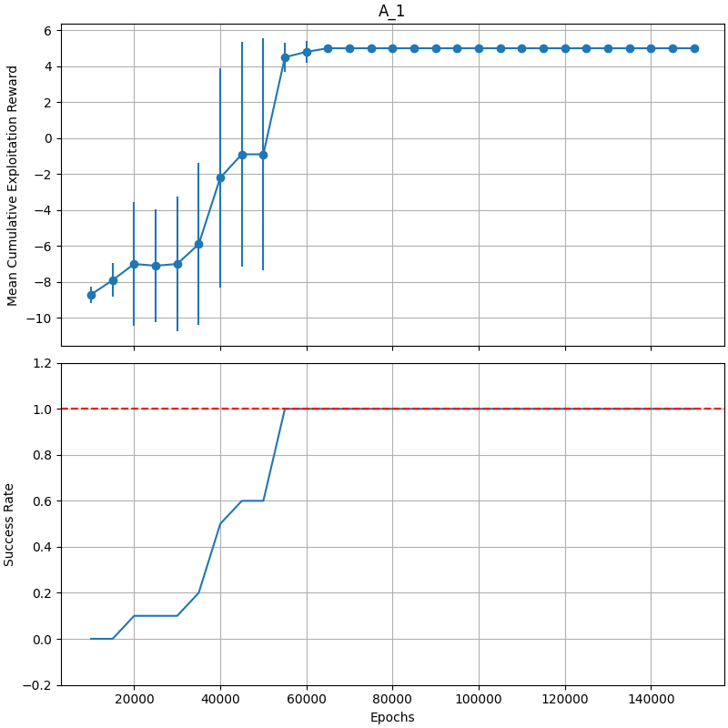

# Multi Agent Games

The purpose of this project is to train an agent, through self play, to play the following game:

- Color the tiles of the table below
- Available colors are two (doesn't matter which they are)
- "Correct" colorization: neihgbouring (up and down) tiles are different color
- Episode ends when all tiles are colored

|     | A     | B     | C     |
| :-: | :---: | :---: | :---: |
| A   |       |       |       |
| B   |       |       |       |
| C   |       |       |       |

The game is played in 4 different configuration rules:

- A.1 -> Agents play simultaneuously & know the environment state
- A.2 -> Agents play simultaneuously & know the results of their own actions
- B.1 -> Agents play one after the other & know the environment state
- B.2 -> Agents play one after the other & know the results of their own actions

**Rewards**

- 1 if neighbouring tiles are different color (empty tile doesn't count) else 0
- -1 if an agent tries to color a tile already colored (color statys the same)
- If they try to color the same tile, one gets -1 and the other the appropriate reward w.r.t. the environment
- 10 if agents reach the desired state at the end of an episode

The rewards are not strict and can be changed.

 

Below there is an experiment run on A.1 game rules, where the game was run for an increasing amount of epochs each time to check for convergence. As we can see the success rate (how many times out of x did the game end on the desired state) for each amount of epochs is monitored. The amount of epochs it takes to converge for each different set of rules differs. For the other games as well you can check the [experiments](https://github.com/alexliap/multiagent_games/tree/main/experiments) directory.

 

 

# Dependencies

- matplotlib
- numpy
- pre-commit
- pyright
- tqdm
